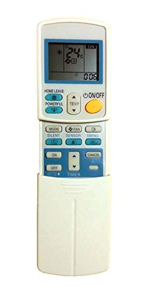
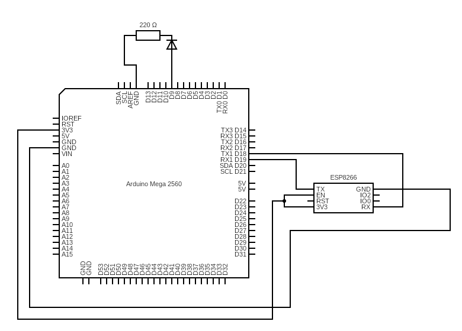
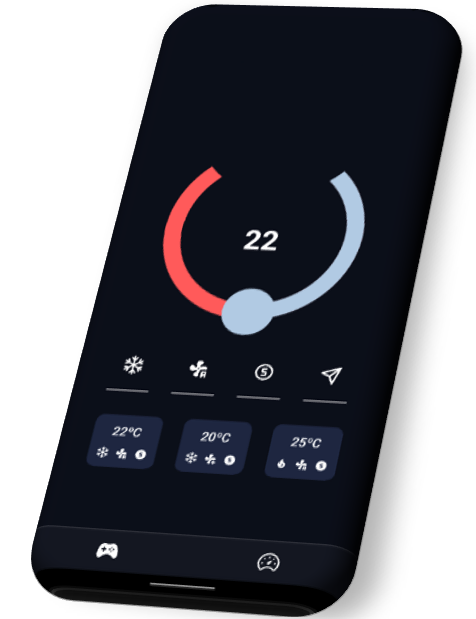

# AC-wiFi-controller
Arduino-based A/C wiFi controller that lets you control your Daikin air conditioning with your smartPhone or even with Siri

Este _README_ está disponible también en [Inglés](README.md)
## INFORMACIÓN

El programa añadido es válido para su uso con los aires acondicionados Daikin, serie ARC.
 
 
This is the remote control you are using currently with your AC:   

## CIRCUITO

### COMPONENTES

- Placa **Arduino Mega**
- Módulo **ESP8266**
- Diodo emisor de **infrarrojos**
- Resistencia 220Ω
- Cables

## PROGRAMA DE ARDUINO

El programa de Arduino se encuentra disponible bajo el nombre de [_ACControl_finalVersion.ino_](/Arduino/ACControl_finalVersion.ino)

El programa usa la siguiente librería:

-	[DYIRDaikin.h](https://github.com/danny-source/Arduino_DY_IRDaikin)

Explicación de este:

En su setup() se encarga de:

- Iniciar la librería del aire acondicionado
- Iniciar Serial para poder recibir información de la placa esp8266

En el loop() se encarga de:

- Ir recibiendo los datos enviados por la placa esp8266 e ir analizándolos:
  - Va carácter por carácter identificando si están las letras que le indican que parámetros debe enviar al aire acondicionado. Si identifica una de ellas lo que hace es guardar el siguiente número para, posteriormente enviarlo al aire acondicionado
- Hay un apartado en donde se identifica si ha escrito ready el módulo
  - Este código sirve por si el módulo tiene un error por cualquier cosa como puede ser sobrecalentamiento, excesivas peticiones, error en una petición…
  - El módulo se reinicia y cuando está listo indica ready; El programa lo detecta y envía los parámetros requeridos para que el módulo pueda ser usado como servidor web y reciba las peticiones que se le envían

La solicitud http se envía a la dirección que el modulo te entregue al poner AT+CIPSTA, seguido de ":elpuertoIndicadoEnELComandoCipMux"

Ejemplo:

http://192.168.1.50:85/\_p0\_t20\_m1\_f1\_s0

las variables se añaden precedidas de un \_ y seguidas por su valor.

### POSIBLES VALORES

- POWER (p): 0 off, 1 on
- TEMPERATURE (t): an int number in the range supported by your air-conditioning
- MODE (m): 0=FAN, 1=COOL, 2=DRY, 3=HEAT(if you have one)
- FAN (f): 0~4=speed(1,2,3,4,5),5=auto,6=moon
- SWING (s): 0 off, 1 on

## APLICACIÓN EN REACT NATIVE

He desarrollado una aplicación en React native que permite el control del aire a través de esta aplicación móvil, válida para dispositivos Android & iOS

El código fuente está incluido en este github y necesita una serie de librerías para funcionar:

- React-navigation (v6)
  - @react-navigation/bottom-tabs
  - @react-navigation/native
- React-native-circle-slider
- React-native-elements
- react-native-webview
- Some Icons:
  - FontAwesome
  - MaterialCommunityIcons
  - Feather
  - EvilIcons
  - Ionicons

La aplicación ha sido creada usando expo-cli

