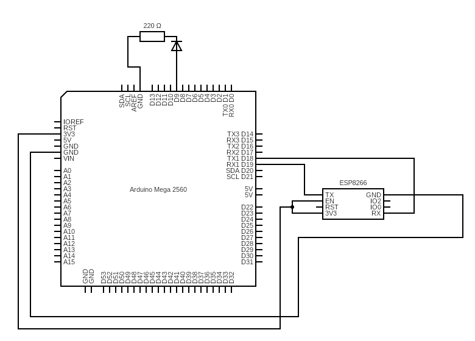

# AC-wiFi-controller
Arduino-based A/C wiFi controller that lets you control your Daikin air conditioning with your smartPhone or even with Siri

This _README_ is also available in [Spanish](README.es.md)

## INFORMATION
The program can be used for the control of the Daikin ARC series
 
 
This is the remote control you are using currently with your AC:   

## CIRCUIT

### COMPONENTS

- **Arduino Mega** board
- **ESP8266** module
- **Infrarred** emisor diode
- 220Ω Resistance
- Wires  

## ARDUINO PROGRAM

The arduino program is the one named [_ACController_finalVersion.ino_](/Arduino/ACController_finalVersion/ACController_finalVersion.ino)

The program uses the following library
-	[DYIRDaikin.h ](https://github.com/danny-source/Arduino_DY_IRDaikin)

Explanation

In its setup() it takes care of:

- Initialize the air conditioner library
- Start Serial to be able to receive information from the esp8266 board

In the loop() it takes care of:

- Receive the data sent by the esp8266 board and analyze it:
  - It goes character by character identifying if there are the letters that indicate the parameters to be sent to the air conditioner. If one of them its identified, what it does is save the next number to later send it to the air conditioning
- There is a section where we try to search for the _ready_ word
  - This code is used in case the module has an error due to anything such as overheating, excessive requests, an error in a request...
  - The module restarts and when it is ready it says _ready_; The program detects it and sends the required parameters so that the module can be used as a web server and receive the requests that are sent to it.

The http request is sent to the address that the module gives you by typing AT+CIPSTA, followed by ":" and the port indicated by the answer of the _AT+CISPTA?_ command

Example:

http://192.168.1.50:85/\_p0\_t20\_m1\_f1\_s0

The variables are written after _ and followed by their value

### POSIBLE VALUES

- POWER (p): 0 off, 1 on
- TEMPERATURE (t): an int number in the range supported by your air-conditioning
- MODE (m): 0=FAN, 1=COOL, 2=DRY, 3=HEAT(if you have one)
- FAN (f): 0~4=speed(1,2,3,4,5),5=auto,6=moon
- SWING (s): 0 off, 1 on

## REACT NATIVE APP

I've developed an app that lets you use your Air Conditioner with your smartPhone, it doesn't matter if it runs iOS or Android
The code is included in the github and it needs some libraries to work:

- React-navigation (v6)
  - @react-navigation/bottom-tabs
  - @react-navigation/native
- React-native-circle-slider
- React-native-elements
- react-native-webview
- Some Icons:
  - FontAwesome
  - MaterialCommunityIcons
  - Feather
  - EvilIcons
  - Ionicons

   

   
The app has been created using expo
